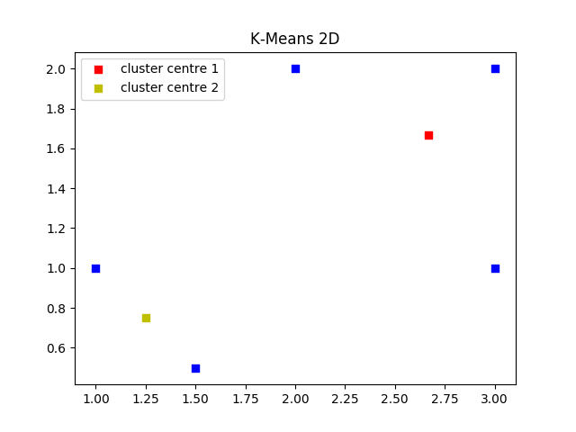
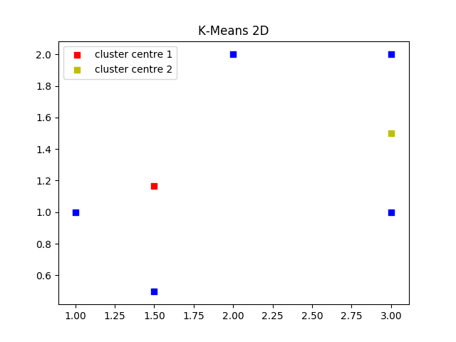

# Kmeans2D
Implementation of K-means algorithm for 2D Co-ordinates without using scikit-learn Python library.

# Input
1. Number of clusters (k): Integer greater than 1 and less than maximum number of 2D co-ordinates
2. Input data (d): 2D co-ordinates should be given in the form of list of lists in Python

# Result
Results include total number of iterations and final cluster centres.

# Example: 
k = 2, d = [[2,2],[3,2],[1,1],[3,1],[1.5,0.5]]

## Output 1:

Total number of iterations: 1, 
Final Centroids: [[2.6666666666666665, 1.6666666666666667], [1.25, 0.75]]

## Output 2:

Total number of iterations: 2, 
Final Centroids: [[1.5, 1.1666666666666667],[3.0, 1.5]]

# Working
1. You do not need any external libraries installed to run the [script](Kmeans2D.py).

2. If you want to implement the algorithm using Scikit-Learn Method, you will need scikit-learn, matplotlib and numpy libraries.

3. The script selects initial centroids randomly, which means the final centroids are not always same, every time the sciprt is executed.

4. Other optimal versions of k-means algorithm take lesser number of iterations to reach the final cluster centroids, by selecting a better initial set of centroids.

# Scikit-Learn Method
The same can be implemented using Scikit-learn, shown by this [script](Kmeans%20SKlearn/KmeansSKlearn.py).
The result of Scikit-learn implementation is shown below.

# License
Licensed under the [MIT License](LICENSE).
